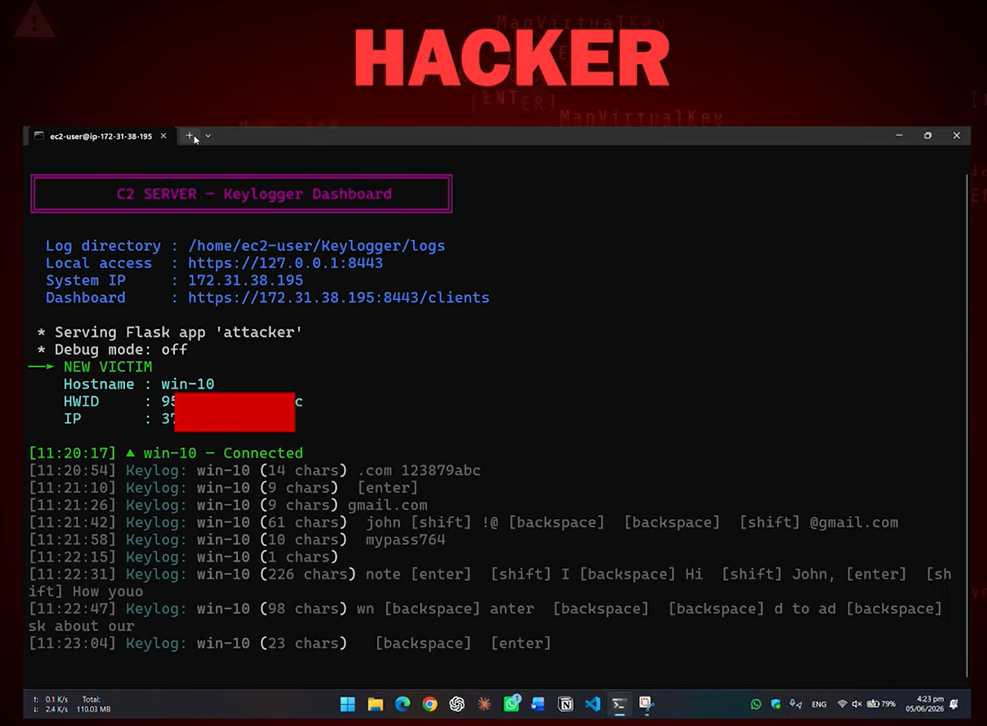
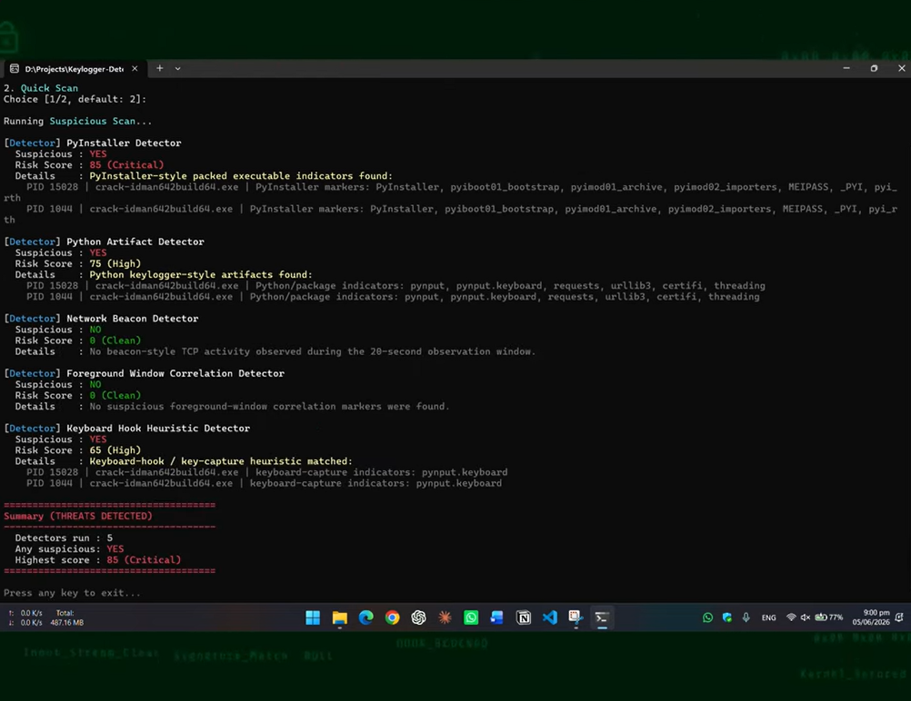

# Windows Keylogger (Educational Project)

<div align="center">
  
</div>

*Image showing keylogger attack (educational purpose)*

> ## Disclaimer
> This is a sanitized educational project created by M Ahmad Amin [@AhmadAmin5](https://github.com/AhmadAmin5) for an Information Security Course Lab at the [University of Engineering and Technology](https://uet.edu.pk) under the supervision of the lab instructor. It is intended only for defensive study in isolated, authorized environments. Do not use it to monitor real users, bypass security controls, distribute malicious software, establish unauthorized persistence, or operate a public C2 server.

[Watch demonstration at YouTube](https://youtu.be/GY4XahJyOGI)

This Project is a Python-based academic project that demonstrates the conceptual operation of a Windows keylogger and a command-and-control (C2) server. The repository represents both the simulated Windows client and the laboratory server side of the system.

The original lab examined executable packaging, multi-client communication, persistence, and techniques threats may use to evade Windows 11 Defender. This public project presents those topics as defensive concepts and does not claim a guaranteed Defender bypass or provide instructions for deploying malware.

#### Detector

As a defense to this offense, I am also proud to present our custom-engineered **[Keylogger Detector](https://github.com/AhmadAmin5/Keylogger-Detector) for Windows** developed at low level in C++, that you must check, availabe at my Github Profile.

<div align="center">
  
</div>

*Image showing keylogger detector*

## Project Overview

The project models the following controlled threat scenario:

- A Windows victim client represented by `victim.py`
- A Python-based laboratory C2 server  `attacker.py`
- Multi-client handling on the server side
- Standalone Windows executable packaging through batch scripts using PyInstaller
- A live delivery page in form of cracked-software at `/download`
- Persistence and endpoint-evasion for defensive analysis
- A companion **C++ Keylogger Detector for Windows** developed to identify keylogger activity running on a system

Packaging the Python components as Windows executables demonstrates why Python does not need to be installed separately on an authorized test machine. The executable and delivery workflow must remain inside a supervised virtual laboratory.


## Tech Stack

- **Primary language:** Python
- **Companion detector:** C++
- **Target environment:** Microsoft Windows
- **Server model:** Client/C2 communication
- **Build automation:** Windows batch scripts
- **Delivery page:** HTML
- **Dependencies:** `requirements.txt`
- **Configuration:** `.env`


## Getting Started

### Prerequisites

- Python 3
- `pip`
- Git
- Attacker Server
- Victim Windows Machine

### 1. Clone the Repository

```bash
git clone https://github.com/AhmadAmin5/Keylogger
cd Keylogger
```


### 2. Create a Virtual Environment
(optional)
```powershell
python -m venv .venv
.venv\Scripts\activate
```

### 3. Install Dependencies

```powershell
python -m pip install -r requirements.txt
```


### 4. Configure Environment Variables

Create a local `.env` file from `.env.sample`:

```powershell
Copy-Item .env.sample .env
```
Set `SERVER_IP` and `SERVER_PORT` variables.


### 5. Build payload
Run the build batch script
```powershell
victim-build.bat
```

### 6. Build payload
Start C2 server
```powershell
python attacker.py
```

## Main Features

### 1. Simulated Windows Client

- Represents the endpoint side of the keylogger scenario
- Demonstrates the privacy risks of unauthorized input monitoring
- Models communication with a controlled laboratory server
- Intended only for synthetic, consent-based test events

### 2. C2 Server

- Represents centralized receipt of authorized test telemetry
- Demonstrates basic client-server communication
- Conceptually supports multiple simulated clients
- Helps students study network behavior and detection opportunities

### 3. Executable Packaging

- Separate batch scripts are included for the client and server components
- Demonstrates packaging Python applications as Windows executables using `PyInstaller`
- Shows why a packaged application can run without a separate Python installation
- Supports discussion of signatures, file reputation, and application control

### 4. Demonstration Delivery Page

- `download.html` models an unsafe cracked-software download page
- Demonstrates how malicious actors may abuse untrusted software distribution
- Supports awareness training about deceptive downloads
- Must not be used to distribute real payloads

### 5. Persistence and Defender-Evasion Study

- Examines persistence and endpoint evasion as threat concepts
- Helps students identify suspicious startup and background activity
- Encourages layered protection instead of reliance on one security control

### 6. C++ Keylogger Detector

As a companion defensive project, we custom-engineered a **C++ based [Keylogger Detector](https://github.com/AhmadAmin5/Keylogger-Detector) for Windows**. It is designed to detect keylogger activity running on a system and complements this project by pairing the simulated threat model with a defensive detection solution.

This combined approach helps demonstrate both sides of information security: understanding how a threat may behave and engineering a tool to identify suspicious activity.

## Educational Learning Workflow

1. Prepare Windows and server virtual machines.
2. Review and configure the components with local laboratory values.
3. Use the batch files to study standalone executable packaging in the supervised lab.
4. Use the download page to discuss cracked-software delivery risks.
5. Generate synthetic test events from the simulated client.
6. Observe authorized telemetry on the laboratory server.
7. Analyze endpoint and network evidence using defensive controls and the companion detector.

Executable deployment, covert installation, real keystroke capture, persistence, and security-control bypass procedures are intentionally outside the scope of this README.

## Project Structure

```text
keylogger/
├── .env.sample          # Template for local lab configuration
├── .gitignore           # Files excluded from Git
├── attacker-build.bat   # Build automation for the server component
├── attacker.py          # C2 server
├── download.html        # Payload deliverypage
├── requirements.txt     # Python dependencies
├── victim-build.bat     # Build automation for the victim
├── victim-icon.ico      # Payload icon
└── victim.py            # Payload code
```

## Defensive Focus

The project helps students recognize indicators such as:

- Unknown executables downloaded from untrusted sources
- Unexpected applications accessing keyboard input
- Suspicious startup or persistence-related changes
- Repeated outbound connections from unfamiliar processes
- Multiple endpoints communicating with the same unusual destination
- Hidden processes or applications without an expected interface
- Alerts from Microsoft Defender, SmartScreen, firewalls, or EDR tools

Recommended protections include trusted software sources, application allowlisting, updated endpoint protection, least-privilege access, network monitoring, code-signature verification, and regular security-awareness training.


## Important Notes

- Use only isolated virtual machines and synthetic input.
- Never enter real passwords or personal information during testing.
- Do not conceal the project inside real software or send it to another person.
- Do not disable or bypass endpoint protection.
- Do not expose the C2 server to the public internet.
- The repository is a sanitized academic concept, not a production malware framework.
- No claim of reliable Windows Defender bypass is made.
- Unauthorized monitoring may violate privacy, computer-misuse, and cybercrime laws.

## Why This Project Is Useful

This project connects Python development, client-server communication, Windows security, social-engineering awareness, and defensive detection. Together with the custom C++ Keylogger Detector, it helps students understand a threat's conceptual lifecycle and the controls used to identify and contain it.